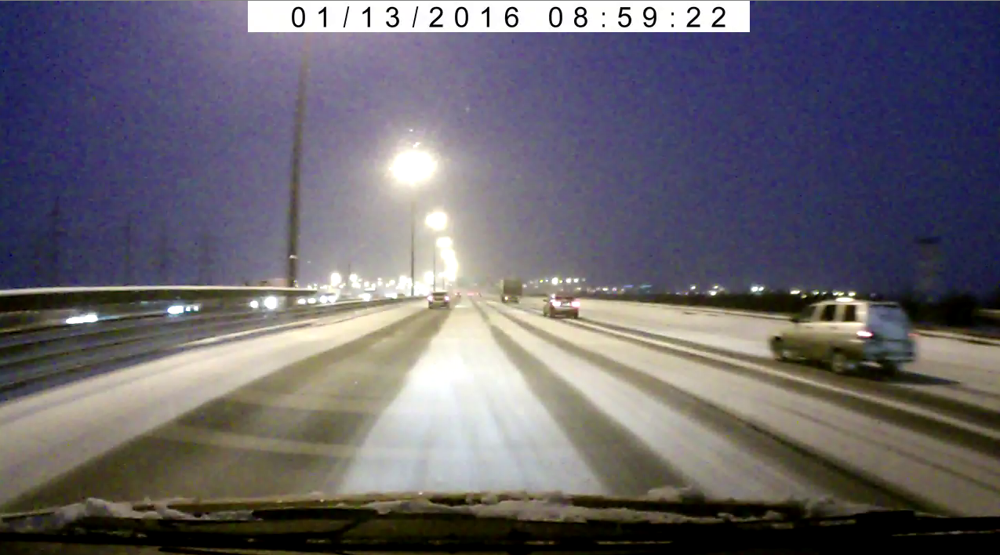

# MyProject

This is a university project, and the reason why I choosed this theme is a wish to discover OpenCV and its general capabilities.
## Technologies:
<li> C++
<li> OpenCV
  
  The random frame of video is showed here on this picture.

And the first problem is to detect road boundaries. To solve this, we should apply color filters and Canny.
